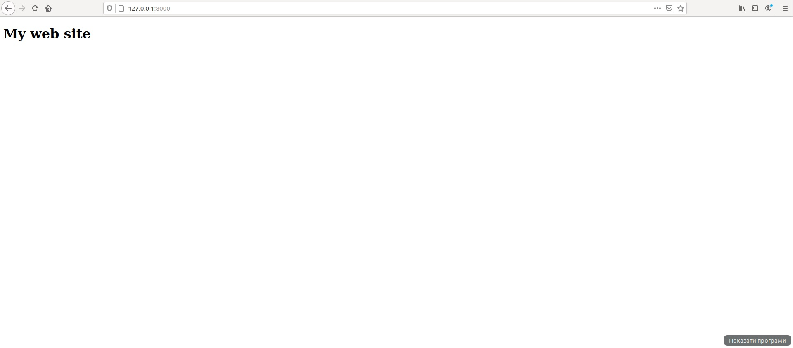
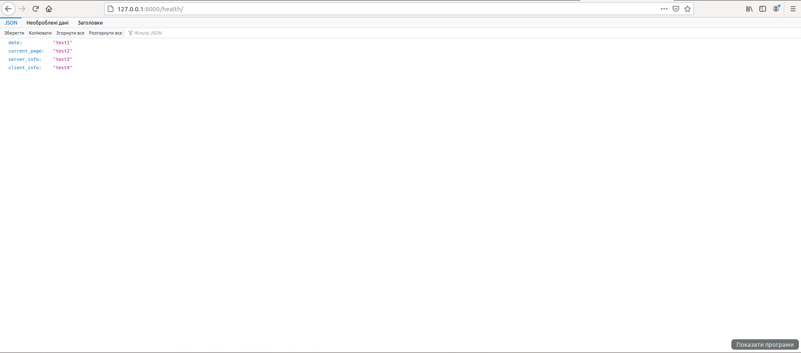

# Lab 3
## Хід роботи
1. Створив віртуальне середовище у папці Lab3 та встановив на неї усі необхідні пакети
            
       (Lab3) user@Pc:~/GitRepos/DevopsLabs/Lab3$ pipenv install django
       Installing django...
       Adding django to Pipfile's [packages]...
       ✔ Installation Succeeded 
       Pipfile.lock not found, creating...
       Locking [dev-packages] dependencies...
       Locking [packages] dependencies...
       Building requirements...
       Resolving dependencies...
       ✔ Success! 
       Updated Pipfile.lock (85c883)!
       Installing dependencies from Pipfile.lock (85c883)...
         🐍   ▉▉▉▉▉▉▉▉▉▉▉▉▉▉▉▉▉▉▉▉▉▉▉▉▉▉▉▉▉▉▉▉ 0/0 — 00:00:00
       (Lab3) user@Pc:~/GitRepos/DevopsLabs/Lab3$ 
2. Створив заготовку сайту за допомогою Django Framework та виніс файли на рівень вище
        
       (Lab3) user@Pc:~/GitRepos/DevopsLabs/Lab3$ pipenv run django-admin startproject my_site
3. Запустив Django сервер за допомогою команди ```pipenv run python manage.py runserver```<br/>

4. Все запустилось успішно і стартова сторінка Django відображається коректно. Зупинив сервер через Ctrl-C та зробив коміт.
5. Створив темплейт свого додатку (app) у якому та закомітив ці файли до свого репозиторію.
6. Створив директорію ```templates``` де створив файл ```main.html``` а також в папці ```main``` створив файл ```urls.py```. Закомітив усе до репозиторію
7. Відредагував файли ```my_site/urls.py``` та ```main/urls.py```.
8. Перейшов до свого додатку та зайнявся WEB сторінками. Для цього:
       
       - створив сторінки двох типів - перша буде зчитуватись з .html темплейта. друга сторінка буде просто повертати відповідь у форматі JSON;
       - відкрив та ознайомився із вмістом файла main/views.py.       
9. Щоб поєднати функції із реальними URL шляхами за якими будуть доступні наші веб сторінки, заповнив файл main/urls.py згідно зразка.Буде два URL посилання:
       
       - головна сторінка яка буде опрацьовуватись функцією main;
       - сторінка health/ яка буде опрацьована функцією health;
   Результати виконання попередніх кроків:


10. Зробив коміт з цими змінами до  свого репозиторію.

